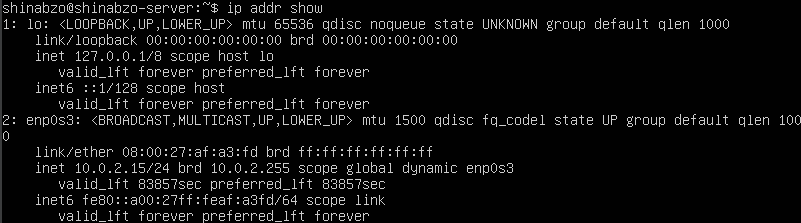
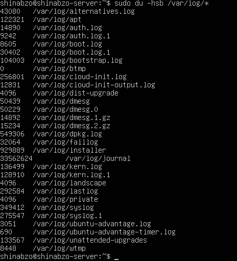

## - Part1. Установка ОС
Установи Ubuntu 20.04 Server LTS без графического интерфейса. (Используем программу для виртуализации - VirtualBox)

## - Part2. Создание пользователя
Создай пользователя, отличного от созданного при установке. Пользователь должен быть добавлен в группу adm.

Новый пользователь должен быть в выводе команды cat /etc/passwd

## - Part3. Настройка сети ОС
Задай название машины вида user-1.

Установи временную зону, соответствующую твоему текущему местоположению. 

Выведи названия сетевых интерфейсов с помощью консольной команды.

Интерфейс lo (loopback device) – виртуальный интерфейс, присутствующий по умолчанию в любом Linux. Он используется для отладки сетевых программ и запуска серверных приложений на локальной машине. 

Используя консольную команду, получи ip адрес устройства, на котором ты работаешь, от DHCP сервера.

DHCP (англ. Dynamic Host Configuration Protocol — протокол динамической настройки узла) — сетевой протокол, позволяющий сетевым устройствам автоматически получать IP-адрес и другие параметры, необходимые для работы в сети TCP/IP.

Определи и выведи на экран внешний ip-адрес шлюза (ip) и внутренний IP-адрес шлюза, он же ip-адрес по умолчанию (gw).

Задай статичные (заданные вручную, а не полученные от DHCP сервера) настройки ip, gw, dns (используй публичный DNS серверы, например 1.1.1.1 или 8.8.8.8).

Перезагрузи виртуальную машину. Убедись, что статичные сетевые настройки (ip, gw, dns) соответствуют заданным в предыдущем пункте.

Успешно пропингуй удаленные хосты 1.1.1.1 и ya.ru и вставь в отчёт скрин с выводом команды. В выводе команды должна быть фраза «0% packet loss».

## - Part4. Обновление ОС
Обнови системные пакеты до последней на момент выполнения задания версии.

## - Part5. Использование команды sudo

Разреши пользователю, созданному в Part 2,выполнять команду sudo.

Команда sudo предоставляет возможность пользователям выполнять команды от имени суперпользователя root, либо других пользователей.

Поменяй hostname ОС от имени пользователя, созданного в пункте Part 2 (используя sudo).

## - Part6. Установка и настройка службы времени

Настрой службу автоматической синхронизации времени.

Выведи время часового пояса, в котором ты сейчас находишься. 

Вывод следующей команды должен содержать NTPSynchronized=yes: timedatectl show

## - Part7. Установка и использование текстовых редакторов

Установи текстовые редакторы VIM (+ любые два по желанию NANO, MCEDIT, JOE и т.д.)

Используя каждый из трех выбранных редакторов, создай файл test_X.txt, где X -- название редактора, в котором создан файл. Напиши в нём свой никнейм, закрой файл с сохранением изменений.

Файл перед закрытием в vim:

Для выхода из vim: esc + :wq.

Файл перед закрытием в nano:

Для выхода из nano: ctrl + O enter ctrl + X

Файл перед закртием в mcedit:

Для выхода из mcedit: f2 + f10

Используя каждый из трех выбранных редакторов, открой файл на редактирование, отредактируй файл, заменив никнейм на строку «21 School 21», закрой файл без сохранения изменений.

Файл перед закрытием в vim:

Для выхода из vim без сохранения: esc :q!

Файл перед закрытием в nano:

Для выхода из nano без сохранения: ctrl + X

Файл перед закртием в mcedit:

Для выхода из mcedit без сохранения: f10

Используя каждый из трех выбранных редакторов, отредактируй файл ещё раз (по аналогии с предыдущим пунктом), а затем освой функции поиска по содержимому файла (слово) и замены слова на любое другое.

Поиск по vim:

Замена в vim:

Пооиск по nano:

Замена в nano:

Поиск по mcedit:

Замена в mcedit:

## - Part8. Установка и базовая настройка сервиса SSHD
Установи службу SSHd.

Установка ssh и openssh-server:

Добавь автостарт службы при загрузке системы.

Перенастрой службу SSHd на порт 2022.

Используя команду ps, покажи наличие процесса sshd. Для этого к команде нужно подобрать ключи.

ps -aux | grep sshd output:

ps-выводит список текущих процессов на вашем сервере в виде таблицы

a-выбрать все процессы, кроме фоновых;

u-выбрать процессы пользователя.

x-заставляет ps перечислить все процессы, принадлежащие вам

Вывод команды netstat -tan должен содержать:

tcp 0 0 0.0.0.0:2022 0.0.0.0:* LISTEN

-tan:

t-по протоколу TCP

a-Отображение всех подключений и ожидающих портов.

n- Отображение адресов и номеров портов в числовом формате.

Cтолбцы:

Recv-Q -количество запросов в очередях на приём на данном узле/компьютере

Send-Q -количество запросов в очередях на отправку на данном узле/компьютере

Local Address - адрес и номер локального конца сокета

Foreign Address - адрес и номер порта удаленного порта сокета

State - состояние сокета

Если в качестве адреса отображается 0.0.0.0 , то это означает - "любой адрес", т. е в соединении могут использоваться все IP-адреса существующие на данном компьютере.

## - Part9. Установка и использование утилит top, htop

Установи и запусти утилиты top и htop.

По выводу команды top определи и напиши в отчёте:

uptime 

количество авторизованных пользователей

общую загрузку системы

общее количество процессов

загрузку cpu

загрузку памяти

pid процесса занимающего больше всего памяти

pid процесса, занимающего больше всего процессорного времени

В отчёт вставь скрин с выводом команды htop:

отсортированному по PID, PERCENT_CPU, PERCENT_MEM, TIME

PID

PERCENT_CPU

PERCENT_MEM

TIME

Отфильтрованному для процесса sshd:

C процессом syslog, найденным, используя поиск:

C добавленным выводом hostname, clock и uptime:

## - Part10. Использование утилиты fdisk

Запусти команду fdisk -l.

Название жесткого диска: /dev/mapper/ubuntu--vg-ubuntu--lv

Размер жесткого диска: 11.51 GB

Количество секторов: 24109056

Рамер swap:

## - Part11. Использование утилиты df

Запусти команду df для корневого раздела (/):

Размер раздела: 11758760

Размер занятого пространства: 2799388

Размер свободного пространства: 8340264

Процент использования: 26%

Единица измерения в выводе-килобайты

df -Th для корневого раздела (/):

Размер раздела: 12 GB

Размер занятого пространства: 2.7 Gb

Размер свободного пространства: 8.0 Gb

Процент использования: 26%

Tип файловой системы для раздела-ext4

## - Part12. Использование утилиты du

Запусти команду du.

Выведи размер папок /home, /var, /var/log (в байтах, в человекочитаемом виде)

Выведи размер всего содержимого в /var/log (не общее, а каждого вложенного элемента, используя *)

## - Part13. Установка и использование утилиты ncdu

Установи утилиту ncdu

Выведи размер папок /home, /var, /var/log

/home

/var

/var/log

## - Part14. Работа с системными журналами

Открой для просмотра:

1. /var/log/dmesg

2. /var/log/syslog

3. /var/log/auth.log

Время последней успешной авторизации: Aug 25 16:19:16

Имя пользователя: shinabzo-server

Метод входа в систему: sudo

Перезапуск службы SSHd

## - Part15. Использование планировщика заданий CRON

Используя планировщик заданий, запусти команду uptime через каждые 2 минуты.

Найди в системных журналах строчки (минимум две в заданном временном диапазоне) о выполнении;

Выведи на экран список текущих заданий для CRON;

Удали все задания из планировщика заданий.

Вставь скрин со списком текущих заданий для CRON.

